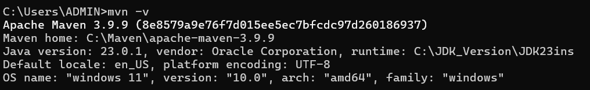

# Compile file .jar from Spring project (Maven project)

## Step 1: Install maven
Goto maven apache home:
[Install maven here](https://maven.apache.org/download.cgi)

## Step 2: Setup maven environment variable
1. Right click on "My Computer" and select "Properties".  
2. Click on "Advanced System Settings".
3. Click on "Environment Variables".
4. Click "New" under "User variables" and add a variable named `Maven_Home` with the value `C:\apache-maven-3.5.0`.
5. Find the `Path` variable in the "System variables" section, select it, and click "Edit".
6. Add `%Maven_Home%\bin` to the `Path` variable.
7. Open `cmd` and run `mvn -version` to verify the installation.

## Step 3: Check maven environment
1. Open cmd.
2. Write command `mvn -v`
3. You will see:


## Step 4: Setup file pom.xml
- In "build" tag, we will setup:
### Maven Build Configuration

```xml
<build>
    <plugins>
        <!-- Spring Boot Maven Plugin -->
        <plugin>
            <groupId>org.springframework.boot</groupId>
            <artifactId>spring-boot-maven-plugin</artifactId>
        </plugin>
        <!-- Maven Jar Plugin -->
        <plugin>
            <groupId>org.apache.maven.plugins</groupId>
            <artifactId>maven-jar-plugin</artifactId>
            <version>3.2.2</version>
            <configuration>
                <archive>
                    <manifest>
                        <mainClass>your_package.Your_Main_Class</mainClass> <!-- Update with your main class -->
                    </manifest>
                </archive>
            </configuration>
        </plugin>
    </plugins>
</build>
```

## Step 5: Compile file .jar
- Open terminal write the command `mvn clean package`
- Then, the file .jar will appear at folder `/target`

## Step 6: Run file .jar (Optional)
1. `cd ./target/`
2. `java -jar your_jar_name.jar`
- If cmd no display any error, such as: `no main manifest attribute`,....
- This file .jar can compose to docker image.


# Compose .jar to docker image

## Step 1: Setup Dockerfile
- This is base setup Dockerfile:
### Dockerfile
```
FROM openjdk:23-oraclelinux8

LABEL authors="tienthuan"

WORKDIR /app

COPY target/demo-0.0.1-SNAPSHOT.jar demo-0.0.1-SNAPSHOT.jar

EXPOSE 8080

CMD ["java", "-jar", "demo-0.0.1-SNAPSHOT.jar"]
```

## Step 2: Run Dockerfile
```sh
docker build -t testdocker .
```

## Step 3: Check your docker image